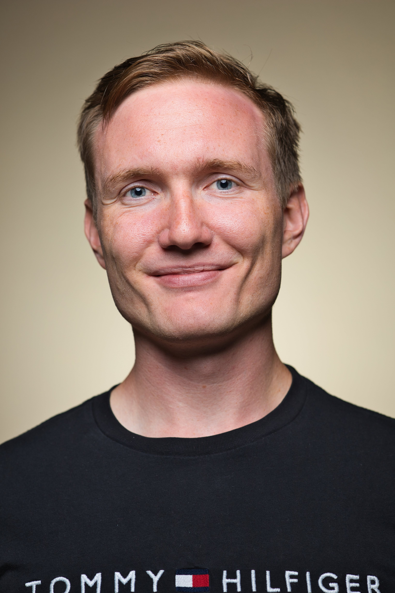

  

   
    
  [juraj.bodik@unil.ch](juraj.bodik@unil.ch) 
  
  [Google scholar](https://scholar.google.com/citations?user=Ip7P8NIAAAAJ&hl=en)
  
  [Researchgate](https://www.researchgate.net/profile/Juraj-Bodik)

  

  

My nickname is Juro (pronounced like €), and I am a Ph.D. student under the supervision of [Prof. Valérie Chavez-Demoulin](https://wp.unil.ch/hecimpact/people/valerie-chavez-demoulin/) at the [University of Lausanne](https://www.unil.ch/hec/en/home.html), Switzerland. I am passionate about mathematical statistics and specialize in the field of causal inference. Through my research and work, I strive to uncover the hidden relationships and causal effects that shape our world.

Currently, my research emphasis lies in [causal discovery](https://towardsdatascience.com/causal-discovery-6858f9af6dcb#:~:text=Causal%20discovery%20aims%20to%20infer,causal%20model%20that%20describes%20it.), focusing on the identifiability of causal relations from observational data. In some of our recent publications, we also combine causal discovery with [Extreme value theory](https://en.wikipedia.org/wiki/Extreme_value_theory) and [time series analysis](https://en.wikipedia.org/wiki/Granger_causality). 

I was born in Slovakia and did my bachelor's and master's in pure mathematics at [Charles University](https://www.mff.cuni.cz/en) in Prague, Czech Republic. During this period, I competed and organized several international problem-solving [competitions](https://www.imc-math.org.uk/?year=2020&item=info) and [camps](https://kms.sk/) in mathematics. My favorite hobbies include [ultimate frisbee](https://www.flyhigh.ultimate.ch/) and beach volleyball at the [beach](https://goo.gl/maps/YQZAVj8VvoEqdKDt6) of Geneva lake. Back in Slovakia, I represented the [Slovak national team](https://wfdf.sport/about-wfdf/member-federations/slovakia/) in the youth world championship in ultimate frisbee.

  

# Latest news
- **I am currently looking for an internship at a research group working on causality. If you know about something please let me know.** 

- New paper about [Discovering plausible direct causes of a target variable](https://arxiv.org/abs/2112.10858) is available on arXiv!  

- New paper about [Identifiability of causal graphs under nonadditive conditionally parametric causal models](https://arxiv.org/abs/2303.15376) is submitted into JRSSb journal. Wish us luck!

